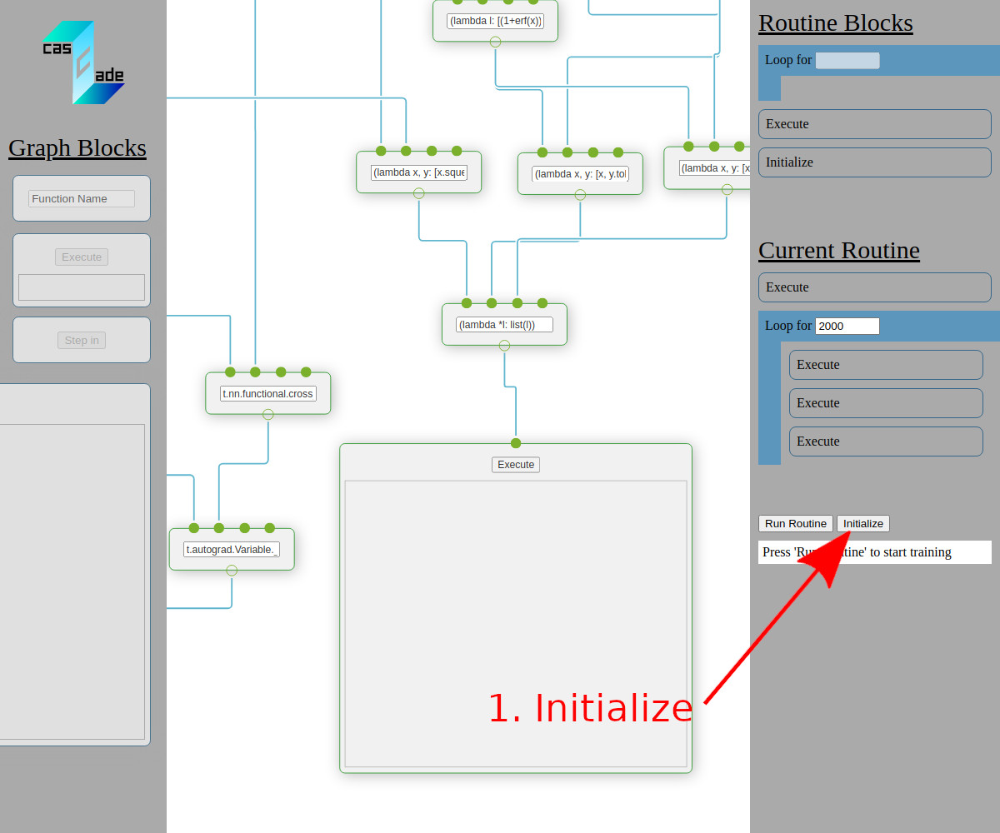
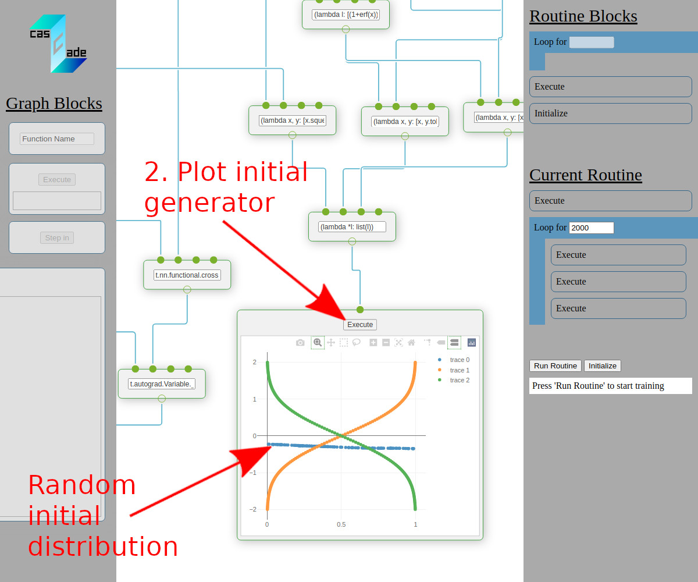
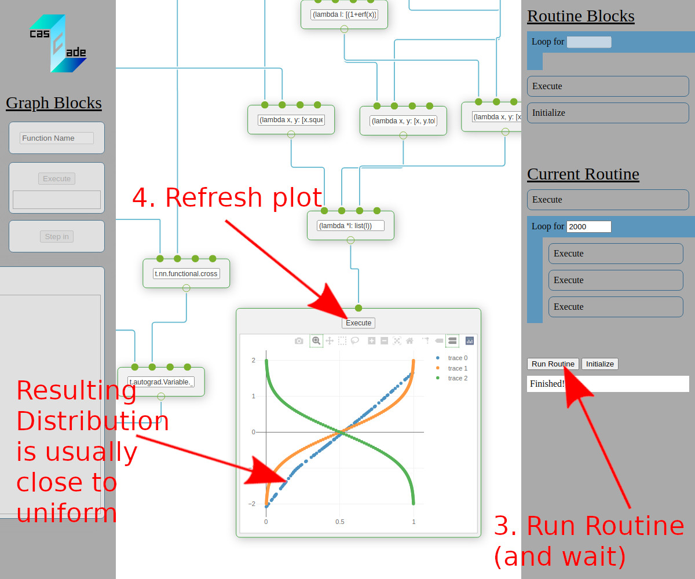
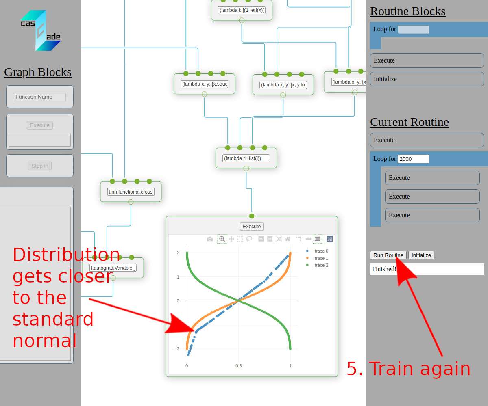
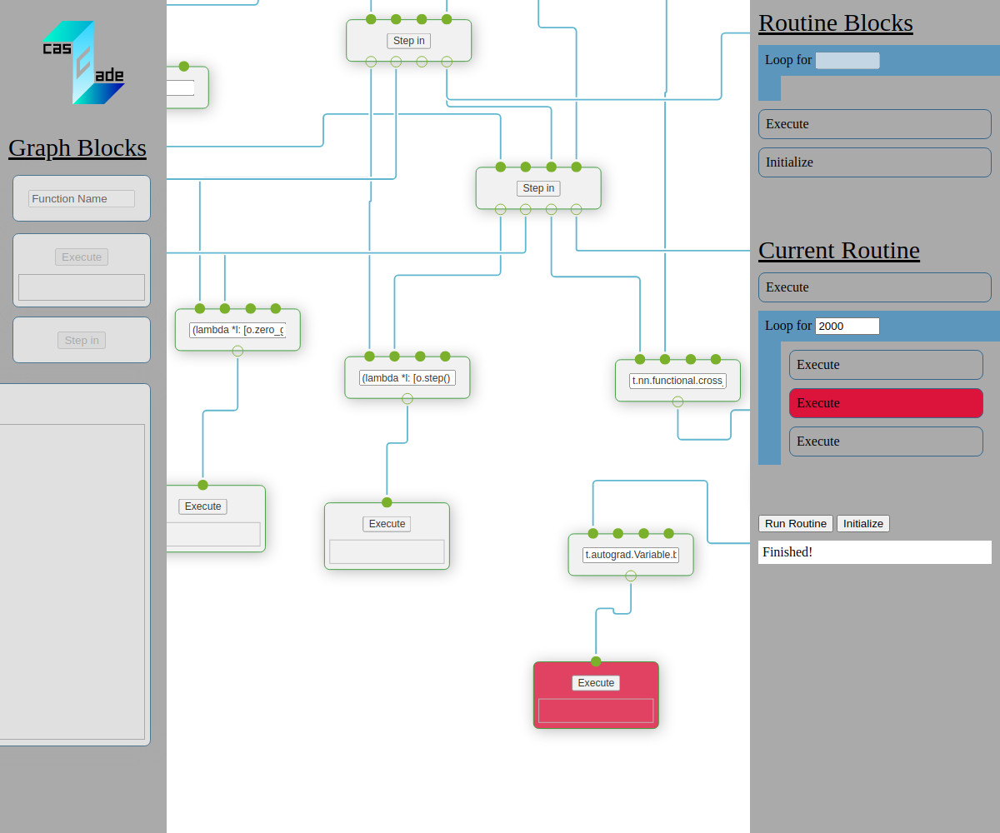

# Cascade - A visual machine learning frame work (mockup)

- Visually arrange a computational graph in the web-based frontend and perform computations on the backend (similar to Jupyter)
- A demo version lets you try it out without the backend - using pyodide to emulate python in javascript 
- Arbitrary python code can be executed
- Many specific features are possible: Dynamic resource allocation, a history of training runs, smart hyperparameter management and more...

# Demo Tutorial
There is a solely web-based demo that showcases how to train a simple GAN to imitate the standard normal distribution in Cascade.
Find it [here](https://quickblink.github.io/cascade/) and follow these steps:

# More Details on how it works
- `Ìnitialize` executes all code in the boxes and saves the results to variables.
- Executing an output or plot box will trigger code to be executed along the computational graph
- Code Boxes without an input will return their value directly
- Code Boxes with inputs are treated as functions and will process the output from connected code boxes
- Plot boxes expect a list of plots, which are two-element lists of lists of data points (this might change in the future)
- Normal output boxes always return the result as string
- In the demo version, `t` is bintorch and `np` is numpy, other imports are currently not available but can
  be added in `server.py` in the offline version
- Open the console to see (python) errors
- Execute blocks in the routine pane must be linked to output boxes by clicking first on the routine execute and then
on the output box in the computational graph. Both should be highlighted in red. Click elsewhere to finish the link.

